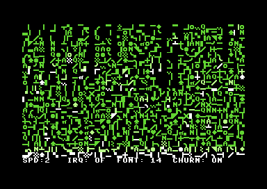

# C64 Matrix Screensaver

A PAL-friendly Commodore 64 text-mode Matrix rain screensaver. It renders a
white-to-green character stream in all 40 columns while reserving the bottom
screen row for a live status display.



*Running in VICE: bright heads, fading green streams, and the protected status
row. The image is an unmodified emulator capture of the built PRG.*

## Features

- 40 independent rain columns with seeded pseudo-random speed and tail length.
- Character ROM copied into RAM for matrix-style graphics glyphs.
- White head, light-green afterglow, green tail, and optional glyph churn.
- Bottom-row status display that remains protected from the rain renderer.
- VICE-friendly hotkeys, with polling in both frame-loop and raster-IRQ modes.
- IRQ mode preserves and restores the pre-existing KERNAL IRQ vector.

## What you see

Every active column has a bright white head, a light-green afterglow, and a
green tail. The head selects a fresh C64 upper/graphics glyph on each update;
with **churn** enabled, some near-head glyphs are also replaced to keep the
streams lively. A small letter set is mixed into the graphics characters so
the output reads as data rather than a repeated tile.

The bottom row is intentionally not part of the rain area. It is a stable OSD
that reports `SPD`, `IRQ`, `FONT`, and `CHURN`, making every interactive change
visible without pausing the effect.

## Build and run

Install [ACME](https://sourceforge.net/projects/acme-crossass/) and VICE, then
run the following from the repository root:

```bash
make audit
make build
make run
```

The build produces `build/c64-matrix-screensaver.prg`, with a BASIC loader that
runs the program at `$2000` (`SYS 8192`). `make run` uses `x64sc`; set
`VICE=x64` if your installation uses that executable name.

`make audit` is a source-level regression check, not an emulator replacement.
It validates the character-ROM mapping, state transitions, protected OSD row,
screen-code labels, and IRQ-vector restoration before assembly.

## Controls

| Key | Action |
| --- | --- |
| `1`–`4` | Set rain update steps per frame. |
| `I` | Toggle raster-IRQ update mode. |
| `F` | Toggle between the two copied character-ROM font regions. |
| `C` | Toggle random tail-glyph churn. |

The status row reports the selected speed, IRQ mode, font region, and churn
setting. In VICE, use Symbolic keyboard mapping, focus the emulator window,
and avoid Warp Mode while testing input.

## Rendering model

The display uses VIC bank 0, screen RAM `$0400`, colour RAM `$D800`, and a
RAM copy of the C64 character ROM at `$1000`–`$1FFF`. Rain writes only rows
0–23. Row 24 is exclusively owned by `DrawStatus`, so animation cannot erase
the control feedback.

Each column transitions through three explicit states: pending spawn, active
head row, and inactive. A pending column enters at row 0; an inactive column
uses the PRNG and `SPAWN_RATE_MASK` to determine when to re-enter. This makes
the first frame visible and prevents the unsigned `$FE/$FF` spawn values from
being mistaken for off-screen rows.

## Program flow

`Start` configures VIC text mode, copies the character ROM into RAM, clears the
screen, seeds all 40 columns, and draws the initial OSD. `UpdateRain` visits
each column and `AdvanceColumn` moves, paints, fades, or respawns that stream.
`Rand8` and `RandGlyphMatrix` provide the deterministic pseudo-random sequence
and glyph selection. `PollKeys` consumes queued keyboard input on every frame.

With IRQ mode off, `Mainloop` waits for a frame and performs the selected number
of updates. With IRQ mode on, the raster handler performs the same updates at
raster line 250 and chains to the KERNAL handler. `EnableIRQ` saves the prior
KERNAL vector once; `DisableIRQ` restores it before returning to frame-loop
mode. `CopyCharset` temporarily exposes the character ROM at `$D000`, copies
it to `$1000`–`$1FFF`, and restores the CPU memory map.

## Project layout

- `src/matrix_screensaver.s` — complete 6502 assembly program.
- `tools/static_audit.py` — regression guards for memory mapping, spawn logic,
  status-row protection, and IRQ-vector restoration.
- `AUDIT.md` — concrete fixes made during the independent import.
- `assets/matrix-screensaver-vice.png` — verified VICE capture used above.

## Limits

The program targets the standard single-VIC C64 text mode and is designed for
PAL-style frame timing. It does not include music, sprites, or a disk loader.

## Provenance

This independent repository was created from the supplied Matrix screensaver
source archive. No licence accompanied that archive; obtain permission from
the original author before redistributing outside your own account.
