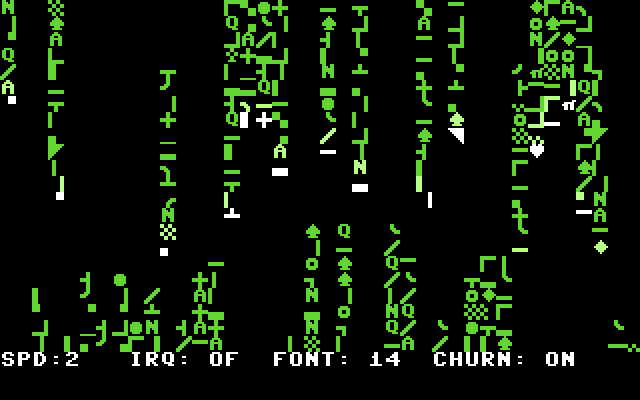

# C64 Matrix Screensaver

A PAL-friendly Commodore 64 text-mode Matrix rain screensaver. It renders a
white-to-green character stream in all 40 columns while reserving the bottom
screen row for a live status display.



*Six-frame looping VICE capture of the built PRG: bright heads, fading green
streams, and the protected status row. The animation uses only live emulator
frames, cropped to the C64 display and nearest-neighbour scaled for clarity.*

## Features

- 40 independent rain columns with seeded pseudo-random speed and tail length.
- Character ROM copied into RAM for matrix-style graphics glyphs.
- White head, light-green afterglow, green tail, and optional glyph churn.
- Bottom-row status display that remains protected from the rain renderer.
- VICE-friendly hotkeys, with polling in both frame-loop and raster-IRQ modes.
- IRQ mode uses a lightweight raster frame tick, preserves CIA/KERNAL timing,
  and restores the prior VIC and KERNAL IRQ state when disabled.

## What you see

Every active column has a bright white head, a light-green afterglow, and a
green tail. The head selects a fresh C64 upper/graphics glyph on each update;
with **churn** enabled, some near-head glyphs are also replaced to keep the
streams lively. A small letter set is mixed into the graphics characters so
the output reads as data rather than a repeated tile.

The bottom row is intentionally not part of the rain area. It is a stable OSD
that reports `SPD`, `IRQ`, `FONT`, and `CHURN`, making every interactive change
visible without pausing the effect.

## Build and run

Install [ACME](https://sourceforge.net/projects/acme-crossass/) and VICE, then
run the following from the repository root:

```bash
make audit
make build
make run
```

The build produces `build/c64-matrix-screensaver.prg`, with a BASIC loader that
runs the program at `$2000` (`SYS 8192`). `make run` uses VICE's standard
post-boot monitor command support to load the PRG and jump to `$2000`; this is
reliable on VICE versions where direct PRG autostart can stop at the BASIC
prompt. Set `VICE=x64` if your installation uses that executable name.

`make audit` is a source-level regression check, not an emulator replacement.
It validates the character-ROM mapping, state transitions, protected OSD row,
screen-code labels, and IRQ-vector restoration before assembly.

## Controls

| Key | Action |
| --- | --- |
| `1`–`4` | Set rain update steps per frame. |
| `I` | Toggle raster-IRQ update mode. |
| `F` | Toggle between the two copied character-ROM font regions. |
| `C` | Toggle random tail-glyph churn. |

The status row reports the selected speed, IRQ mode, font region, and churn
setting. In VICE, use Symbolic keyboard mapping, focus the emulator window,
and avoid Warp Mode while testing input.

## Rendering model

The display uses VIC bank 0, screen RAM `$0400`, colour RAM `$D800`, and a
RAM copy of the C64 character ROM at `$1000`–`$1FFF`. Rain writes only rows
0–23. Row 24 is exclusively owned by `DrawStatus`, so animation cannot erase
the control feedback.

Each column transitions through pending spawn, an on-screen head row, a virtual
off-screen drain phase, and inactive. A pending column enters at row 0; after
the head passes row 23, its tail continues to fade and clear before the column
becomes inactive. The inactive phase uses the PRNG and `SPAWN_RATE_MASK` to
determine when to re-enter. This makes the first frame visible, prevents the
unsigned `$FE/$FF` spawn values from being mistaken for off-screen rows, and
prevents completed streams from leaving stale characters behind.

## Program flow

`Start` configures VIC text mode, copies the character ROM into RAM, clears the
screen, seeds all 40 columns, and draws the initial OSD. `UpdateRain` visits
each column and `AdvanceColumn` moves, paints, fades, or respawns that stream.
`Rand8` and `RandGlyphMatrix` provide the deterministic pseudo-random sequence
and glyph selection. `PollKeys` consumes queued keyboard input on every frame.

With IRQ mode off, `Mainloop` waits for a frame and performs the selected number
of updates. With IRQ mode on, the raster handler at line 250 only records a
frame tick; rendering remains in the main loop, avoiding long work inside an
interrupt. It then chains to the previously installed handler. `EnableIRQ`
saves the KERNAL vector and VIC IRQ state once; `DisableIRQ` restores both
before returning to frame-loop mode. `CopyCharset` temporarily exposes the
character ROM at `$D000`, copies it to `$1000`–`$1FFF`, and restores the CPU
memory map.

## Project layout

- `src/matrix_screensaver.s` — complete 6502 assembly program.
- `tools/static_audit.py` — regression guards for memory mapping, spawn logic,
  status-row protection, and IRQ-vector restoration.
- `tools/vice_run.mon` — deterministic VICE startup script used by `make run`.
- `AUDIT.md` — concrete fixes made during the independent import.
- `assets/matrix-screensaver-vice.gif` — animated VICE capture used above.
- `assets/matrix-screensaver-vice.png` — full-frame VICE screenshot.

## Limits

The program targets the standard single-VIC C64 text mode and is designed for
PAL-style frame timing. It does not include music, sprites, or a disk loader.

## Provenance

This independent repository was created from the supplied Matrix screensaver
source archive. No licence accompanied that archive; obtain permission from
the original author before redistributing outside your own account.
